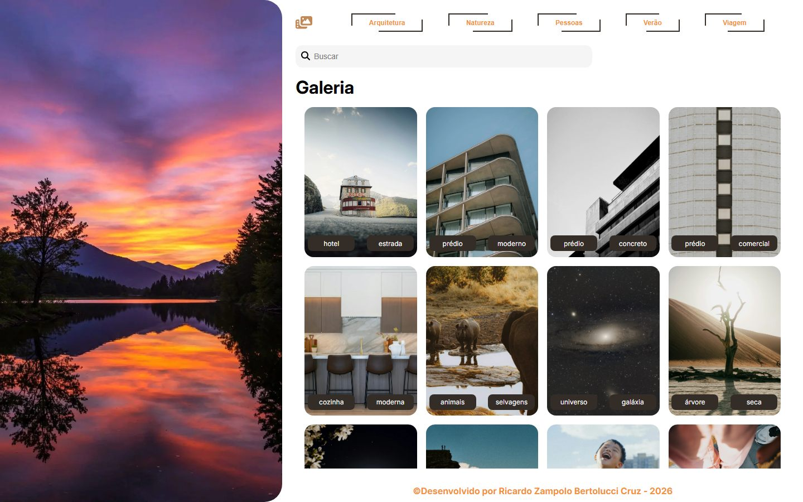

# 🖼️ Galeria de Imagens

Galeria responsiva com filtro por categoria, busca em tempo real e visualização em lightbox. Construída com **HTML, CSS e JavaScript puro**, sem frameworks ou bibliotecas.

🔗 **[Acessar o projeto](https://ricardobertolucci.github.io/Galeria-de-Imagens/)**



---

## ✨ Funcionalidades

- **Grid responsivo** com CSS Grid — o número de colunas se ajusta sozinho à largura da tela
- **Filtro por categoria com múltipla seleção** — selecione quantas categorias quiser; nenhuma selecionada exibe a galeria inteira
- **Busca em tempo real** por título ou por tag, filtrando a cada tecla digitada
- **Filtros combinados** — categoria e busca atuam juntos (E lógico)
- **Lightbox** ao clicar em qualquer imagem, com navegação ← / → percorrendo apenas as imagens filtradas
- **Fechamento por Esc** ou pelo botão de fechar
- **Estado vazio** com mensagem quando nenhuma imagem corresponde aos filtros
- **Lazy loading** em todas as imagens
- **Botões de categoria gerados dinamicamente** a partir dos dados — adicionar uma categoria nova no arquivo de dados cria o botão sozinho

---

## 🛠️ Tecnologias

- **HTML5** — marcação semântica e atributos `data-*`
- **CSS3** — Grid, Flexbox, variáveis CSS, `aspect-ratio`, `object-fit`, `clip-path`, pseudo-elementos e media queries
- **JavaScript (ES6+)** — manipulação do DOM, `Set`, `filter`, `some`, desestruturação, spread e delegação de eventos
- **Metodologia BEM** — convenção de nomenclatura das classes CSS

---

## 📁 Estrutura do projeto

```
galeria-de-imagens/
├── index.html
├── css/
│   └── style.css
├── js/
│   ├── data.js       # banco de imagens
│   └── gallery.js    # filtros, busca e lightbox
├── assets/
│   └── images/
└── README.md
```

Cada imagem é descrita por um objeto em `js/data.js`:

```js
{
  src: "images/arquitetura-01.webp",
  titulo: "Hotel de estrada",
  categoria: "Arquitetura",
  tags: ["hotel", "estrada"]
}
```

São 25 imagens distribuídas em 5 categorias: Arquitetura, Natureza, Pessoas, Verão e Viagem.

---

## 🚀 Como executar localmente

O projeto não depende de servidor — basta abrir o `index.html` no navegador.

Para clonar:

```bash
git clone https://github.com/RicardoBertolucci/Galeria-de-Imagens.git
```

---

## 🧩 Decisões técnicas

**Dado plano em vez de agrupado**
As imagens vivem num único array, cada objeto carregando sua própria categoria, em vez de estarem agrupadas por categoria. Assim cada item é autossuficiente: ao abrir o lightbox, a imagem sabe a que categoria pertence sem depender de onde foi retirada. Agrupar por categoria facilitaria só uma pergunta ("tudo de X"), mas complicaria a busca por texto entre categorias e a exibição de tudo de uma vez. É a mesma razão pela qual um banco relacional usa uma tabela com coluna `categoria`, e não uma tabela por categoria.

**Um único ponto de renderização**
Toda mudança — clique em categoria, tecla digitada na busca — passa pela mesma função, que decide a lista visível, limpa o grid e redesenha. O carregamento inicial não é um caso especial: é o filtro rodando sem nenhuma restrição ativa. Isso elimina caminhos paralelos que precisariam ser mantidos em sincronia.

**`Set` para as categorias ativas**
A multi-seleção exige acumular escolhas entre cliques. O `Set` recusa duplicatas por natureza, remove por valor (sem precisar localizar índice) e responde `has()` em uma expressão — exatamente a pergunta que o filtro faz para cada imagem. O `size === 0` ainda resolve de graça o caso "nenhuma categoria selecionada, mostre tudo".

**Delegação de eventos**
Os cards e os botões de categoria são criados por JavaScript e recriados a cada filtro. Registrar um listener por elemento exigiria reatribuir tudo a cada renderização; em vez disso, um único listener no contêiner captura os cliques por borbulhamento e identifica o alvo com `closest()`.

**Índice no `data-*`, dado no array**
Cada card guarda apenas sua posição na lista visível. O objeto com título, tags e caminho continua no array — o DOM informa *qual* item foi clicado, e o array fornece *o que* ele é. Por isso a navegação do lightbox percorre a lista filtrada, e não as 25 imagens.

**`aspect-ratio` + `object-fit: cover` nos cards**
As fotos têm proporções diferentes (paisagem e retrato). Fixar a proporção do card e recortar o excesso mantém o grid alinhado sem distorcer nenhuma imagem. No lightbox a lógica se inverte: a caixa tem tamanho fixo e a imagem usa `object-fit: contain`, para que a foto apareça inteira e o layout não salte ao alternar entre formatos.

**Classes de estado separadas do BEM**
Classes utilitárias como `.is-hidden` ficam fora do padrão `bloco__elemento--modificador` de propósito: elas descrevem um estado momentâneo, não um estilo. Declaradas ao fim da folha, vencem os componentes por ordem de cascata quando aplicadas.

---

## 👤 Autor

**Ricardo Zampolo Bertolucci Cruz**

[LinkedIn](https://www.linkedin.com/in/ricardo-bertolucci/) · [GitHub](https://github.com/RicardoBertolucci)
